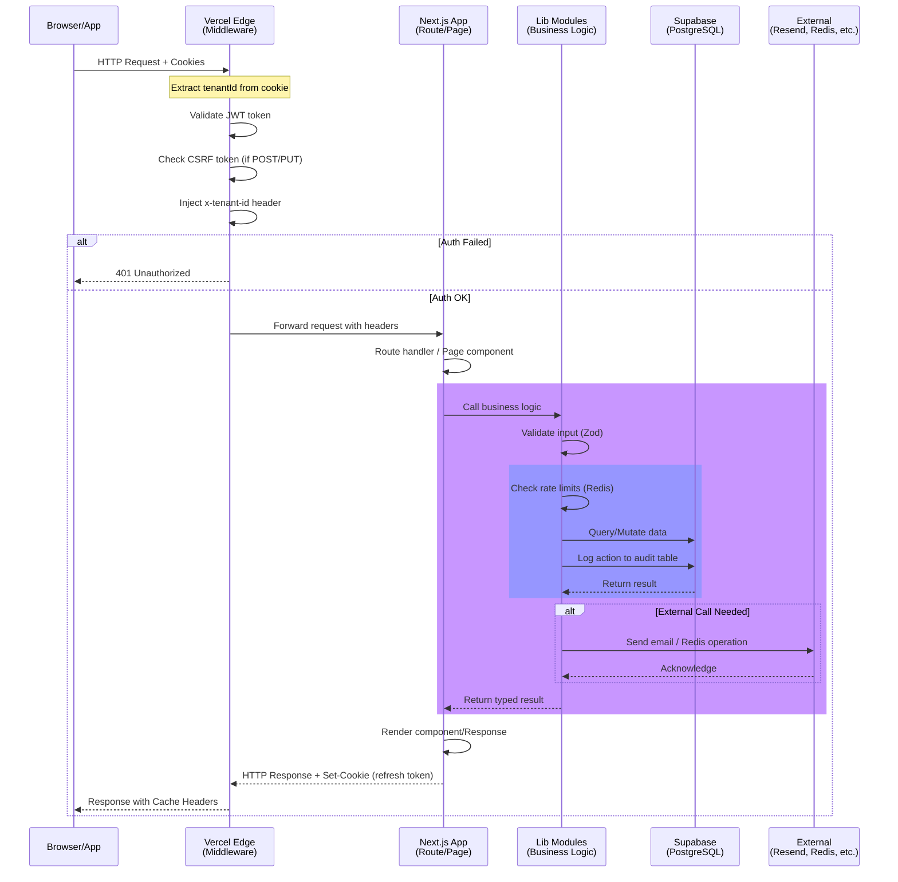
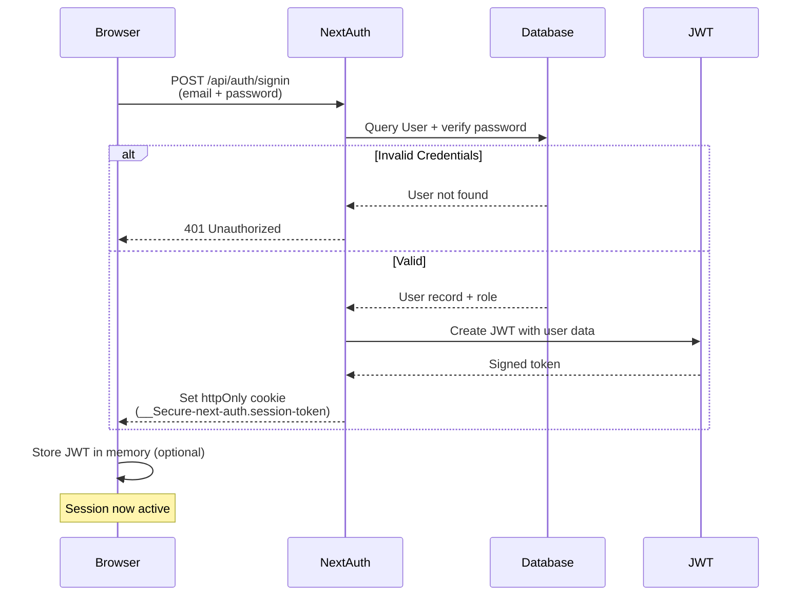
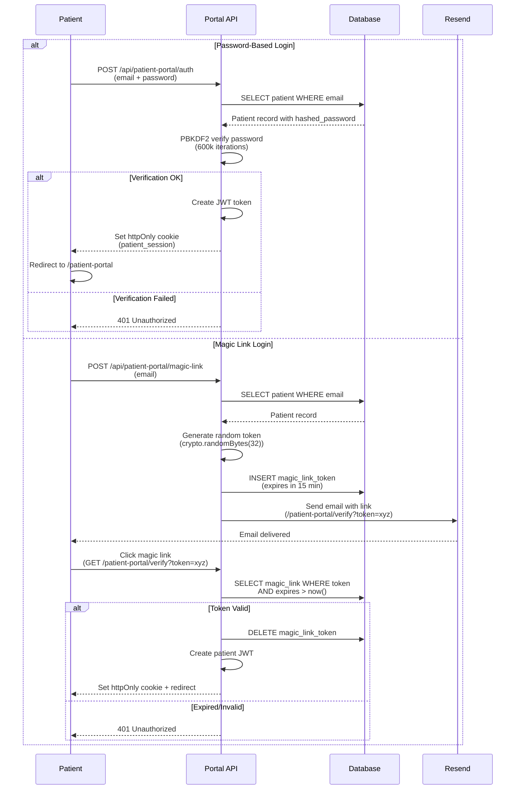

# Architecture Documentation

**Psycologger System Design & Data Flow**

**Generated:** 2026-04-04

---

## High-Level Architecture

Psycologger is a **monolithic SaaS application** built on Next.js 14 (App Router) with a PostgreSQL backend (Supabase). The architecture follows a traditional **three-tier model** with a focus on security, multi-tenancy, and Edge-compatibility.

```
┌─────────────────────────────────────────────────────────────────┐
│                         CLIENTS                                  │
│  ┌──────────────┐          ┌──────────────┐                     │
│  │  Web Browser │          │  Mobile App  │                     │
│  │ (Staff/Admin)│          │  (Patients)  │                     │
│  └──────────────┘          └──────────────┘                     │
└─────────────────────────────────────────────────────────────────┘
                              │
                              ▼
┌─────────────────────────────────────────────────────────────────┐
│               VERCEL EDGE NETWORK (CDN/Caching)                  │
│                  Next.js Middleware Layer                        │
│         (Auth check, Tenant injection, CSRF validation)          │
└─────────────────────────────────────────────────────────────────┘
                              │
                              ▼
┌─────────────────────────────────────────────────────────────────┐
│                   NEXT.JS APPLICATION LAYER                      │
│  ┌─────────────────┐  ┌──────────────────┐  ┌──────────────┐   │
│  │  Server Pages   │  │   API Routes     │  │ Middleware   │   │
│  │ (Data fetch,    │  │  (Business logic,│  │ (Auth, CSRF, │   │
│  │  middleware)    │  │   validation)    │  │  tenantId)   │   │
│  └─────────────────┘  └──────────────────┘  └──────────────┘   │
│                                                                  │
│  ┌──────────────────────────────────────────────────────────┐   │
│  │            LIB MODULES (Business Logic)                   │   │
│  │  ┌─────────────┐ ┌───────────┐ ┌──────────────────┐      │   │
│  │  │ Auth        │ │ Logger    │ │ Rate Limiter     │      │   │
│  │  │ Encryption  │ │ Validator │ │ Permissions      │      │   │
│  │  │ Email       │ │ File Stg  │ │ Integrations     │      │   │
│  │  └─────────────┘ └───────────┘ └──────────────────┘      │   │
│  └──────────────────────────────────────────────────────────┘   │
│                                                                  │
│  ┌──────────────────────────────────────────────────────────┐   │
│  │              DATABASE LAYER (Prisma ORM)                  │   │
│  │  30+ Models, Soft-delete, Audit hooks, Transactions      │   │
│  └──────────────────────────────────────────────────────────┘   │
└─────────────────────────────────────────────────────────────────┘
                              │
          ┌───────────────────┼───────────────────┐
          │                   │                   │
          ▼                   ▼                   ▼
    ┌─────────────┐    ┌─────────────┐    ┌──────────────┐
    │  Supabase   │    │  Upstash    │    │ Resend Email │
    │ PostgreSQL  │    │   Redis     │    │   Service    │
    └─────────────┘    └─────────────┘    └──────────────┘
          │
          ├─ Supabase Storage (S3-compatible)
          └─ Supabase Realtime (WebSockets for future features)
```

---

## Request Flow (Sequence Diagram)



---

## Multi-Tenancy Architecture

### Core Principle
**Every database query includes a `tenantId` filter to prevent cross-tenant data leaks.**

### Implementation Pattern

#### 1. Tenant ID Sources (in order of precedence)
```typescript
// a) From NextAuth session (staff)
const session = await getServerSession();
const tenantId = session.user.tenantId;

// b) From patient session + request headers (portal)
const patientSession = await getPatientSession(request);
const tenantId = patientSession.tenantId;

// c) From middleware (injected into headers)
const tenantId = headers().get('x-tenant-id');
```

#### 2. Middleware Injection
```typescript
// src/app/middleware.ts
export async function middleware(request: NextRequest) {
  // 1. Extract & validate session
  const session = await getServerSession();
  if (!session?.user.tenantId) return NextResponse.redirect('/login');

  // 2. Inject tenant ID into headers for route handlers
  const requestHeaders = new Headers(request.headers);
  requestHeaders.set('x-tenant-id', session.user.tenantId);

  // 3. Forward request with modified headers
  return NextResponse.next({ request: { headers: requestHeaders } });
}
```

#### 3. Database Query Pattern
```typescript
// ✅ CORRECT: Always include tenantId in WHERE clause
const patients = await db.patient.findMany({
  where: {
    tenantId: headers().get('x-tenant-id'),
    deletedAt: null,  // Soft-delete filter
  },
});

// ❌ WRONG: Missing tenantId filter (security bug!)
const patients = await db.patient.findMany();
```

#### 4. Tenant-Scoped Relationships
```prisma
// schema.prisma
model Tenant {
  id String @id @default(cuid())
  name String
  patients Patient[]
  appointments Appointment[]
  // ...
}

model Patient {
  id String @id @default(cuid())
  tenantId String
  tenant Tenant @relation(fields: [tenantId], references: [id])

  appointments Appointment[]
  sessions SessionNote[]
  // ... all relations also include tenantId

  @@index([tenantId])  // Indexed for query performance
}

model Appointment {
  id String @id @default(cuid())
  tenantId String
  patientId String
  patient Patient @relation(fields: [patientId], references: [id])
  tenant Tenant @relation(fields: [tenantId], references: [id])

  @@index([tenantId, patientId])
  @@index([tenantId, scheduledAt])
}
```

#### 5. Cookie-Based Tenant Selection
```typescript
// Staff can switch tenants (if multi-tenant admin)
// Tenant preference stored in cookie:
document.cookie = 'tenantId=tenant_123; SameSite=Strict; Secure';

// Middleware reads tenant from:
// 1. Session (primary source)
// 2. Cookie (fallback for SPA navigation)
```

---

## Authentication Architecture

### Dual Auth System

Psycologger implements **two separate authentication systems** for two user types:

#### 1. Staff Authentication (NextAuth + JWT)

**Users:** Psychologists, admins, assistants, superadmin

**Flow:**


**Key Details:**
- **Adapter:** Prisma adapter (sessions stored in DB for revocation)
- **Session type:** JWT with `maxAge: 24h` (staff)
- **Refresh:** Implicit via NextAuth callback
- **Logout:** Session.destroy + cookie deletion
- **Role info:** Stored in JWT payload (PSYCHOLOGIST, TENANT_ADMIN, etc.)

**Session Payload:**
```typescript
{
  id: 'user_123',
  email: 'dr.silva@clinic.com',
  name: 'Dr. Silva',
  role: 'PSYCHOLOGIST',
  tenantId: 'tenant_456',
  iat: 1712275200,
  exp: 1712361600,  // 24 hours
}
```

#### 2. Patient Authentication (Custom PBKDF2 + Magic Links)

**Users:** Patients accessing portal

**Flow:**


**Key Details:**
- **Password hashing:** PBKDF2 with 600,000 iterations (OWASP 2023 standard)
- **Timing-safe comparison:** Prevents timing attacks
- **Magic links:** 15-minute expiration, single-use only
- **Session timeout:** 30 minutes of inactivity (idle logout)
- **Session token:** Stored in httpOnly, Secure, SameSite=Strict cookie

**Patient Session Payload:**
```typescript
{
  id: 'patient_789',
  name: 'João Silva',
  email: 'joao@example.com',
  tenantId: 'tenant_456',
  role: 'PATIENT',
  iat: 1712275200,
  exp: 1712278800,  // 1 hour or 30 min idle
}
```

---

## Data Flow Architecture

### Request → Database → Response

```
┌────────────────────────────────────────────────────────────────┐
│ 1. CLIENT REQUEST                                               │
│    POST /api/patients/123/appointments                          │
│    Body: { date: '2026-04-15', time: '14:00' }                 │
│    Cookie: __Secure-next-auth.session-token=...                │
└────────────────────────────────────────────────────────────────┘
                              │
┌────────────────────────────────────────────────────────────────┐
│ 2. MIDDLEWARE LAYER                                             │
│    • Verify JWT token                                           │
│    • Extract tenantId from session                              │
│    • Validate CSRF token (double-submit check)                  │
│    • Inject x-tenant-id header                                  │
│    → Result: Request validated, tenant context set              │
└────────────────────────────────────────────────────────────────┘
                              │
┌────────────────────────────────────────────────────────────────┐
│ 3. API ROUTE HANDLER (next.js route.ts)                         │
│    • Extract session: session = await getServerSession()        │
│    • Check authorization: if (session.user.role !== 'PSYCH.') │
│    • Validate input: appointmentSchema.parse(body)             │
│    → Result: Input validated, user authorized                   │
└────────────────────────────────────────────────────────────────┘
                              │
┌────────────────────────────────────────────────────────────────┐
│ 4. BUSINESS LOGIC (lib modules)                                 │
│    • Check rate limits: await checkRateLimit(userId, action)   │
│    • Check permissions: can(session.user, 'CREATE_APPT')       │
│    • Encrypt sensitive data (if journal entry, payment, etc.)   │
│    → Result: Business rules verified                            │
└────────────────────────────────────────────────────────────────┘
                              │
┌────────────────────────────────────────────────────────────────┐
│ 5. DATABASE LAYER (Prisma)                                      │
│    await db.appointment.create({                                │
│      data: {                                                    │
│        patientId: '123',                                        │
│        tenantId: headers().get('x-tenant-id'),  ◄─ KEY!        │
│        scheduledAt: new Date('2026-04-15 14:00'),              │
│      }                                                          │
│    })                                                           │
│    → Result: Row inserted in DB                                 │
└────────────────────────────────────────────────────────────────┘
                              │
┌────────────────────────────────────────────────────────────────┐
│ 6. AUDIT LOGGING (lib/logger.ts)                                │
│    • Log action to AuditLog table                               │
│    • Include: userId, action, tenantId, timestamp               │
│    • Redact PHI: patient names, SSNs, payment info (in logs)   │
│    → Result: Action recorded for compliance                     │
└────────────────────────────────────────────────────────────────┘
                              │
┌────────────────────────────────────────────────────────────────┐
│ 7. RESPONSE TO CLIENT                                           │
│    { data: { id: 'appt_999', ... }, status: 201 }             │
│    Set-Cookie: refresh_token=... (if needed)                   │
│    Cache-Control: private, no-cache                            │
│    → Result: Client receives data                               │
└────────────────────────────────────────────────────────────────┘
```

---

## Multi-Layer Security

### 1. Transport Security (HTTPS)
- **TLS 1.3+** enforced by Vercel edge
- **HSTS preload** headers set
- **Certificate:** Managed by Vercel (auto-renewal)

### 2. Request Authentication
- **JWT verification** in middleware
- **Session validation** on every route
- **Refresh token rotation** (NextAuth)
- **Token expiration:** 24h staff, 1h portal (with 30-min idle timeout)

### 3. Cross-Site Request Forgery (CSRF)
- **Double-submit cookie pattern:**
  1. Server generates token: `csrf_token = randomBytes(32)`
  2. Token sent in response body + Set-Cookie header
  3. Client reads from body, sends in X-CSRF-Token header
  4. Server compares: `request.body.csrf === cookies.csrf`

  **Why double-submit?** Resistant to XSS; can't steal token from same-origin script attacks.

- **SameSite=Strict cookies** (extra defense)

### 4. Encryption at Rest
- **Algorithm:** AES-256-GCM (authenticated encryption)
- **Key management:** Master key in env var, rotated annually
- **What's encrypted:**
  - Journal entries (patient privacy)
  - Payment information (PCI-DSS requirement)
  - Consent documents (legal sensitivity)
  - API keys / secrets

**Encryption example:**
```typescript
// lib/encryption.ts
const encrypted = encrypt(patientJournal, 'AES-256-GCM');
// Stores: { iv, ciphertext, authTag, algorithm }

const decrypted = decrypt(encrypted, 'AES-256-GCM');
// Returns: plaintext journal
```

### 5. Password Security
- **PBKDF2 with 600,000 iterations** (OWASP 2023 recommendation)
- **Timing-safe comparison:** Prevents timing attacks
- **Password requirements:** 8+ characters, no common words (future)
- **Password reset:** Via magic link (no password recovery questions)

### 6. Input Validation
- **Zod schemas** on all request bodies
  - Type coercion (e.g., string to date)
  - Format validation (email, phone, ISO-8601)
  - Length constraints
  - Custom validations (e.g., appointmentDate > today)

- **SQL injection prevention:** Prisma parameterized queries
- **XSS prevention:** React auto-escaping + Content Security Policy

### 7. Rate Limiting
- **Upstash Redis** (distributed)
- **Fallback:** In-memory store (single server)
- **Strategies:**
  - Login: 5 attempts per 15 minutes per IP
  - API: 100 requests per minute per user
  - File upload: 10 uploads per hour per user
  - Email send: 5 emails per hour per patient

### 8. Content Security Policy (CSP)
```
script-src 'strict-dynamic' 'nonce-{random}' 'unsafe-inline' https:;
style-src 'unsafe-inline' https:;
img-src 'self' https:;
font-src 'self' https:;
connect-src 'self' https://api.resend.com;
frame-ancestors 'none';
```
- **Nonces:** Random per request, prevents inline script injection
- **strict-dynamic:** Only allows scripts with correct nonce

### 9. Audit Logging
- **49 tracked actions:** Create, read, update, delete, login, etc.
- **Immutable logs:** Inserted into DB, never deleted (soft-delete only)
- **PHI redaction:** Patient names, SSNs, payment info removed from log text
- **Retention:** 90 days (configurable), then archived

---

## Key Architecture Decisions & Trade-offs

| Decision | Why | Trade-off |
|----------|-----|-----------|
| **JWT over DB sessions** | Edge-compatible (Vercel Functions), no DB lookup per request | Requires token refresh for logout, bigger payload |
| **AES-256-GCM over libsodium** | Battle-tested, Node.js built-in support, faster | Requires key management (no Argon2) |
| **Resend over SendGrid** | Better latency to Brazil, simpler pricing | Smaller email provider, less third-party integrations |
| **Supabase Storage over S3 direct** | No AWS account needed, built-in auth, easier setup | Vendor lock-in (though S3-compatible), slightly higher latency |
| **Upstash Redis over self-hosted** | No server to maintain, global replication, cheaper at scale | Vendor lock-in, network latency for every rate-limit check |
| **Monolith over microservices** | Easier to develop, deploy, debug; sufficient for current scale | May need refactoring at 10M+ requests/month |
| **Server Components by default** | Reduced client JS, built-in data fetching, better SEO | Harder to implement real-time features (WebSockets) |
| **Soft-delete pattern** | Data recovery, audit trail, LGPD compliance (30-day retention) | Requires tenantId + deletedAt on every query (indexes needed) |

---

## Deployment & Infrastructure

### Vercel (Platform)
- **Runtime:** Node.js serverless functions
- **Region:** São Paulo (gru1) — 1-2ms latency to Brazil
- **Auto-scaling:** 0-3000+ concurrent functions
- **Pricing:** Usage-based (function invocations + bandwidth)
- **Observability:** Built-in logs, analytics, monitoring

### Supabase (Database)
- **Service:** Managed PostgreSQL
- **Features:** Row-level security (RLS), Realtime (WebSockets), Storage
- **Backups:** Automated daily, 30-day retention
- **Scaling:** Vertical (connection pooling, indexes), limits at ~50M rows per tenant
- **Cost:** Compute + storage usage

### Upstash (Cache/Rate Limiting)
- **Service:** Managed Redis
- **Features:** Global replication, REST API, Kafka (future)
- **Pricing:** Requests + storage
- **Fallback:** In-memory store on rate-limit miss (optional)

### Resend (Email)
- **Features:** Transactional email, templates, bounce handling
- **Latency:** 100-500ms (async)
- **Pricing:** Per email sent (~$0.0001 each)
- **Deliverability:** 98%+ to major ISPs

---

## Example: Complete Request Flow

**Scenario:** Psychologist books an appointment for patient

### Step 1: Client Sends Request
```javascript
// src/components/appointments/AppointmentForm.tsx
const response = await fetch('/api/appointments', {
  method: 'POST',
  headers: {
    'X-CSRF-Token': csrfToken,
    'Content-Type': 'application/json',
  },
  body: JSON.stringify({
    patientId: 'patient_123',
    scheduledAt: '2026-04-15T14:00:00Z',
    type: 'INITIAL',
  }),
});
```

### Step 2: Middleware Validates
```typescript
// src/app/middleware.ts
const session = await getServerSession();
if (!session) return NextResponse.redirect('/login');

const tenantId = session.user.tenantId;
const csrfToken = request.headers.get('x-csrf-token');
// verify CSRF token...

// Inject tenant into request
const headers = new Headers(request.headers);
headers.set('x-tenant-id', tenantId);
return NextResponse.next({ request: { headers } });
```

### Step 3: API Route Processes
```typescript
// src/app/api/appointments/route.ts
export async function POST(request: Request) {
  const session = await getServerSession();
  if (!session) return unauthorized();

  const body = appointmentSchema.parse(await request.json());
  const tenantId = headers().get('x-tenant-id');

  // Call service
  const appointment = await createAppointment({
    tenantId,
    userId: session.user.id,
    ...body,
  });

  return NextResponse.json({ data: appointment }, { status: 201 });
}
```

### Step 4: Business Logic (Service Layer)
```typescript
// src/lib/appointment-service.ts
export async function createAppointment(input) {
  // Check permissions
  const canCreate = can(input.userId, 'CREATE_APPOINTMENT');
  if (!canCreate) throw new ForbiddenError();

  // Check rate limit
  await checkRateLimit(input.userId, 'create_appointment', 10, '1h');

  // Validate patient exists & belongs to tenant
  const patient = await db.patient.findUnique({
    where: { id: input.patientId, tenantId: input.tenantId },
  });
  if (!patient) throw new NotFoundError('Patient');

  // Create appointment
  const appointment = await db.appointment.create({
    data: {
      tenantId: input.tenantId,
      patientId: input.patientId,
      psychologistId: input.userId,
      scheduledAt: input.scheduledAt,
      type: input.type,
    },
  });

  // Log action
  await logAction({
    tenantId: input.tenantId,
    userId: input.userId,
    action: 'APPOINTMENT_CREATED',
    resourceId: appointment.id,
    details: { patientId: input.patientId }, // PHI fields omitted
  });

  // Send reminders (async)
  sendAppointmentReminders(appointment).catch(console.error);

  return appointment;
}
```

### Step 5: Database Mutation
```sql
-- Executed by Prisma
INSERT INTO "Appointment" (
  id, tenantId, patientId, psychologistId, scheduledAt, type, createdAt, updatedAt
) VALUES (
  'appt_123', 'tenant_456', 'patient_123', 'user_789',
  '2026-04-15 14:00:00', 'INITIAL', now(), now()
);

-- Audit log (separate transaction)
INSERT INTO "AuditLog" (
  id, tenantId, userId, action, resourceId, details, createdAt
) VALUES (
  'log_999', 'tenant_456', 'user_789', 'APPOINTMENT_CREATED', 'appt_123',
  '{"patientId":"patient_123"}', now()
);
```

### Step 6: Response Sent
```javascript
// Client receives
{
  "data": {
    "id": "appt_123",
    "patientId": "patient_123",
    "psychologistId": "user_789",
    "scheduledAt": "2026-04-15T14:00:00Z",
    "type": "INITIAL",
    "createdAt": "2026-04-04T12:34:56Z"
  },
  "status": 201
}
```

---

## Scalability Considerations

### Current Limits
- **Concurrent users:** ~100-200 per tenant
- **Queries per second:** ~1,000 (Supabase shared tier)
- **Data per tenant:** ~1 GB (soft limit, no hard enforcement)
- **File storage:** ~50 GB (Supabase shared tier)

### Scaling Strategies (if needed)
1. **Vertical scaling (easy):**
   - Supabase: Upgrade to dedicated instance
   - Upstash: Upgrade Redis plan
   - Resend: Already scales automatically

2. **Horizontal scaling (medium):**
   - Add database read replicas
   - Cache frequently-accessed data (Upstash)
   - Implement API rate-limiting tiers

3. **Architectural refactoring (hard):**
   - Break monolith into services (appointments, sessions, billing)
   - Event-driven architecture (Kafka or PubSub)
   - Multi-region deployment

### Performance Optimizations (In Place)
- **Database indexes:** On `(tenantId, patientId)`, `(tenantId, scheduledAt)`, etc.
- **Query pagination:** 50 items/page by default
- **Caching headers:** Cache-Control: max-age=3600 for static assets
- **Image optimization:** Next.js Image component with lazy loading
- **Code splitting:** Automatic per-route in Next.js App Router

---

## Summary

**Psycologger's architecture is a modern, secure, multi-tenant SaaS built for scalability and compliance.** The dual-auth system (NextAuth + custom PBKDF2) handles staff and patients separately. Multi-tenancy is enforced at the database layer via `tenantId` on every query. Security is layered: HTTPS, JWT + CSRF, AES-256-GCM encryption, rate limiting, and comprehensive audit logging. The monolithic Next.js + Supabase + Vercel stack is ideal for pre-beta: simple to develop, easy to deploy, and scalable to millions of requests with minimal refactoring.

---

**Last Updated:** 2026-04-04
**Next Review:** 2026-05-04
**Last verified against code:** 2026-04-07
- CPF encryption with blind index implementation verified
- Clinical notes encryption with production rejection option verified
- Default appointment types seeding verified
- NextAuth events enrichment verified
- Patient token hashing verified
- CSRF narrowed allowlist verified
